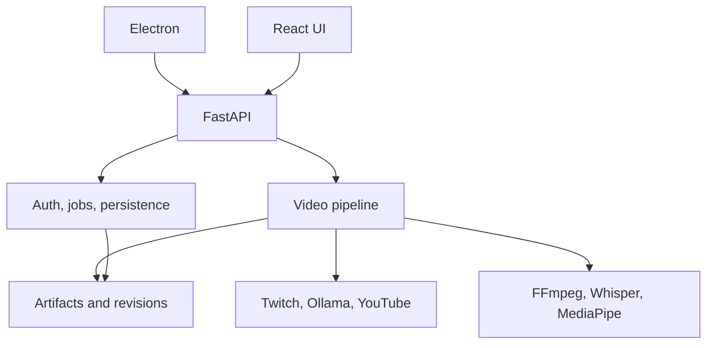

# Технический аудит Highlight Studio 11.2.7

## Решение о выпуске

**Массовый выпуск: BLOCKED.** Передаётся исправленный исходный portable-архив с пересобранным frontend, тестами и доказательствами. Windows installer/portable EXE в этой среде не собраны и не подписаны. Исходный архив не следует выдавать за проверенный установщик.

Работа включала инвентаризацию дерева, статический обзор подсистем, воспроизведение полного набора тестов, исправление подтверждённых дефектов, новые отрицательные регрессии, чистую сборку и проверку упаковки. Все условия большого задания невозможно подтвердить без Windows/NVIDIA, реальных VOD, аккаунтов и AI-моделей; ниже эти границы перечислены явно. Нет заявления, что каждый путь 11-тысячестрочного pipeline проверен вручную.

Исходный файл: `Highlight_Studio_11.2.7_FULL(2).zip`, 531 entry. Исходная версия: `11.2.7 / v11.2.7-quality-recovery-audit / studio-audited-v15`. Версия сохранена, журнал относится к исправленному варианту того же релиза. Root архива остаётся `Highlight_Studio_11.2.7`.

## Точные результаты

| Проверка | Результат | Граница доказательства |
|---|---|---|
| Исходный Python suite | 530 passed, 10 failed, 3 warnings; 30.59 s | Среда после установки requirements-dev |
| Исходный frontend | 92 passed, 16 failed, 0 skipped | Node tests |
| Новые первоначальные negative regressions | 10 failed | Сначала воспроизведены на неисправленном коде |
| Итоговый Python suite | 1 failed, 568 passed, 3 warnings in 36.48s | Один настоящий FAIL — native MediaPipe не загрузил libGLESv2.so.2; 0 skipped |
| Итоговый frontend | 112 passed, 0 failed, 0 skipped | Включает production JS в JSDOM и async race tests |
| Electron policy/IPC | 10 passed, 0 failed, 0 skipped | Node, без GUI Electron runtime |
| Python lint | PASS | `ruff check backend tools tests services` |
| Frontend lint | Exit 0, 0 errors, 1 warning | `react-hooks/exhaustive-deps` в workflow guard App.jsx остаётся |
| Python compile | PASS | backend, tools, services, tests |
| Node syntax | PASS | Electron main/preload/security/ipc_policy и website/app.js |
| Production build | PASS | `npm ci`, Vite 8.0.16; Node 24.19.0 |
| Повторная сборка | PASS | Две чистые Vite-сборки дали одинаковые SHA-256 inputs/outputs и manifest |
| Release identity | PASS | backend canonical loader; frontend, Electron, Tauri metadata, locks, dist, docs |
| Реальные media tests | 26 passed, 1 warning; 7.38 s | Выборочный прогон real FFmpeg/Shorts + новые регрессии; входит/пересекается с full suite |
| pip-audit после обновления | 0 известных уязвимостей | requirements.txt; не означает отсутствие неизвестных проблем |
| npm frontend audit | 0 известных уязвимостей | После 11 совместимых transitive package updates |
| npm Electron audit | 0 известных уязвимостей | По lock-файлу; полная установка в этой среде не завершилась |
| Archive contract / SHA-256 | PASS, конечный archive gate выполнен | Проверка всех содержимых, запрещённых entries, required layout |
| Существующий mass-release gate | FAIL, 21 blockers, 4 warnings, score 19 | Никакое поле evidence не подделывалось |

Текстовые протоколы лежат в `docs/releases/11.2/evidence-1127/`. Числа выборочных прогонов нельзя суммировать с общим количеством: наборы перекрываются. Случаи API/RBAC, называющиеся PostgreSQL tests, не подтверждают подключение к настоящему production PostgreSQL. Время synthetic media тестов не является benchmark длинного Twitch VOD.

Прямой native test падает на отсутствующей системной библиотеке. Попытка системной установки была отклонена ограничениями среды; безопасная попытка `apt-get download libgles2` также не смогла найти пакет в доступных индексах. Тест не удалён, не ослаблен и не помечен skip. В Dockerfile и Linux CI внесены зависимости `libgles2 libegl1`; сам Docker image/CI здесь не запускался.

## Подтверждённые исправления

1. **Сохранность метаданных.** При пустом монтаже возвращается ошибка без перезаписи `youtube_metadata.json`. Cancel проверяется до любой генерации. Strict failure не записывает пустой результат. Non-strict AI failure при существующем валидном результате также сохраняет файл и сообщает ошибку. Если результата нет, доказательный локальный fallback разрешён и остаётся `ai_used=false`. Повторная генерация по явному запросу без AI по-прежнему доступна.
2. **Резервные JSON.** `write_json` проверяет старый документ перед backup, копирует в временный файл и атомарно заменяет `.bak`. Повреждённый main больше не уничтожает последнюю хорошую копию при неуспешной новой записи. Сохранены bounded Windows-lock retries. Это не общая транзакция между всеми файлами проекта и не доказательство устойчивости к отключению питания файловой системы.
3. **Проверка медиа.** Duration должен быть finite и >0. Успешный код возврата ffprobe с отсутствующим видеопотоком или битым JSON не подменяется воображаемым 1920×1080. Новые тесты проверяют NaN, Infinity, отрицательную/нулевую длительность и audio-only ответ.
4. **Честные статусы.** Metadata background job не завершает `done` при `ok=false`; локальный результат обозначается как локальный, strict mode требует `ai_used=true`.
5. **Секреты.** JobLogger редактирует credentials до записи, logs API скрывает секреты и в старых журналах. Sanitizer обрабатывает `accessToken/clientSecret`. Ошибка AI редактируется перед попаданием в пользовательскую ошибку; regression проверяет и файл, и исключение.
6. **Polling.** Отдельный `serialPoll.js` планирует следующий запрос после завершения предыдущего. App abort-ит запрос при cleanup и отвергает ответ с устаревшим sequence. Это небольшой feature-independent utility с тремя behavioral tests; полноценный rewrite App не выполнялся.
7. **Release integrity.** Vite выводит asset marker из canonical identity; successful build пишет `build-manifest.json` со SHA-256 source, public, package/lock/config/build script, identity и всего dist. Gate обнаруживает правку source без build, изменённый output и старый лишний bundle. Проверяются package/lock versions, текущие документы, public/dist parity и уникальный entry JS. Это provenance/checksum gate, а не криптографическая подпись сборщика.
8. **Упаковка/CI.** make_release проверяет identity/build до упаковки, пишет staging archive и не разрешает output внутри source tree. verify_archive проверяет directory traversal и регистронезависимые коллизии Windows. CI release job действительно собирает frontend в checkout, который пакует. `.gitattributes` фиксирует текстовые LF для стабильных fingerprints на Windows. Windows CHECK_V1127 запускает полный доступный automated gate и останавливается на любой ошибке.
9. **Зависимости.** Pin cryptography обновлён 49.0.0 → 50.0.0; frontend и desktop lock-файлы обновлены без `--force`/major upgrade прямых JS зависимостей. Базовые сканеры сообщали 7 frontend affected packages, 6 desktop packages и finding cryptography; повторные сканеры чисты. Официальное описание изменения cryptography: https://cryptography.io/en/latest/changelog/ (50.0.0). Возможность эксплуатации каждого transitive package именно приложением отдельно не доказывалась.
10. **Документация.** Созданы AUDIT, BUILD_INFO, CHANGE_REPORT, TECHNICAL_AUDIT и checklist 11.2.7. Шесть исторических заметок перенесены из root. Diagnostics получают identity из JSON. Исторические документы предыдущих версий намеренно не переписывались.

## Карта фактического продукта

| Часть | Реальная роль и связи |
|---|---|
| `START_HERE.bat`, commands, scripts/windows | Windows entry points → Electron либо локальный uvicorn; FFmpeg/GPU setup и packaging |
| `backend/main.py`, pipeline.py и другие root backend wrappers | Import aliases через import_module/sys.modules; каноническая реализация находится в backend/src/highlight_studio |
| `api/app.py` | 177 HTTP route decorators в обследованной версии; auth/CORS/cookies, project lifecycle, Review, jobs, output serving, creator pack, diagnostics |
| `services/pipeline.py` | 11 737 строк перед последним локальным security edit; ASR/analysis/refill/montage/render/captions/Shorts/metadata/export orchestration |
| `services/hardware.py`, face_tracking.py, whisper_worker.py | Hardware probes в child process, CPU MediaPipe Tasks с bundled TFLite, ASR worker |
| `core` | Settings/identity, artifact names, JSON/process utilities, durable stage state, revisions/freshness |
| `integrations` | Ollama transport/runtime/circuit/retry, Twitch download/probe, YouTube publishing |
| `infrastructure` | SQLite jobs, project thread locks, process-local ResourceManager, auth/RBAC, SQLAlchemy/Alembic, licensing, privacy/support, release evidence |
| `frontend/src/app/App.jsx` | Около 3 939 строк: workflow/state/effects/API orchestration; feature-компоненты Shorts/auth/onboarding существуют отдельно |
| `frontend/src/features/shorts` | Нативный React editor: local drafts, manual caption/crop поля, per-item save/render, preview и safe zones |
| `frontend/public` | Public CSS/presentation helper, release.json, отдельный YouTube publisher; копируются в dist |
| `frontend/dist` | Vite assets и static files, обслуживаемые backend; актуальная сборка включена в архив |
| `desktop/electron` | Единственная поддерживаемая desktop shell: local engine lifecycle, restricted preload/IPC, updater, NSIS/portable metadata |
| `desktop/tauri` | Экспериментальный scaffold; не полноценный runtime и не альтернативный production installer |
| `vendor` | Windows TwitchDownloaderCLI.exe и aria2c.exe, лицензии; FFmpeg бинарники устанавливаются отдельно |
| `services/license_server`, website, deploy | Отдельный licensing service, статический сайт, Docker/Caddy web deployment; не запускались в production |
| `.github/workflows`, tools/release, tools/diagnostics | CI, Windows signing/build, archive/identity gate, ручные диагностики |
| `tests`, frontend/tests, electron/tests | Unit/contract/integration/media/DOM/security; много исторических source-string contracts всё ещё существуют |
| `docs`, alembic | Исторические материалы отделены от актуальных; account/RBAC schema migration |



API содержит business orchestration, что остаётся долгом. Прямых FastAPI imports в services при статическом поиске не найдено. ResourceManager и project locks защищают потоки одного процесса; несколько backend-процессов на одной data directory не проверены и не заявлены поддерживаемыми.

CSS действительно многослойный: main.jsx импортирует index/theme/redesign/workspace/studio-v2/studio-v3/studio-final и Shorts CSS; index.html также подключает public studio-v3 и final override. Самый крупный redesign — 2 356 строк, final — 2 204. Удалять слой без pixel/visual regression на целевых разрешениях рискованно; консолидация перенесена. В этом исправлении визуальная схема не менялась.

`shorts-editor-1126.js` — исторический compatibility bridge. Он остаётся в public/dist для совместимости, но текущий index.html его НЕ загружает, потому что нативный React editor уже присутствует. Переименование или повторное включение создало бы второго владельца UI/polling. `ui-presentation-101515.js` сохранён как presentation helper; tests запрещают его network/polling/navigation hacks. Исторические patch_frontend/sync_dist scripts не используются текущим CI; применять их к dist после build теперь запрещает fingerprint gate.

## Изменение тестов: что устарело, а что было сломано

- `index-1126-*` и `HSAnalysisCurrent`, `hsPending`, `Ji`, `l`, `re`, `w` — номера/имена конкретной старой минификации, не продуктовый контракт. Проверки source/bundle связаны build fingerprint, а реальные операции проверяются DOM-suite на production JS.
- `audit1126.test.js` больше не вырезает функции по именам минификатора: исполняет фактические именованные source-функции с контролируемым IO. Сохранены проверки позднего dashboard, saved edit, latest request, double click, fallback/error notice, A→B→A, ownership mutation lock.
- Review integration fixtures теперь содержат реальные `source_ready/freshness` поля, mock atomic remove endpoint и выбор вкладки альтернатив. Добавлены проверки, что первоначально выбран финальный монтаж. Поиск карточки использует нужный UI-контейнер: заголовок может легально оставаться в плеере.
- Assertions для нативного Shorts проверяют вынесенный `ShortsStudio.jsx`; compatibility bridge должен оставаться выключенным. Настоящие contract assertions editable fields/regeneration/safe zone/CSRF не удалены.
- Windows replacement retry test считает повторы замены основного файла, отдельно от новой атомарной замены backup. Проверяются те же 3 transient failures и успешная четвёртая попытка.
- Добавлены `test_audit_regressions_1127.py`, `test_release_integrity_1127.py`, archive attack cases, Unicode/apostrophe FFmpeg case, serialPoll tests и `production.integration.test.js`.
- Никакой failing test не удалён/skip ради PASS. Отказ native MediaPipe остался видимым. Отдельных marker-наборов unit/integration/e2e в pytest пока нет; существующий общий suite сохранён, media/DOM/release выборки документированы.

## Что проверено и что ещё неизвестно

| Область | Реальные evidence | Остаточная граница/причина |
|---|---|---|
| Import/Twitch/resume | Tests twitch_live/turbo_restore, download/probe contracts | Реальная сеть Twitch, истечение токена, часы VOD: NOT VERIFIED — нет исходного видео/аккаунта |
| Whisper/audio | Worker crash/cancel/cache/recovery regressions | Полный ASR multilingual/no-speech/VAD/OOM с моделью: NOT VERIFIED — модели не загружены |
| Ranking/refill | Longform target, semantic quality, primary-live tests | Не измерена человеческая релевантность на 30+ VOD; target не повышали искусственно |
| AI runtime | Retry/circuit/stream completion/cancel/fallback tests | TTFT/stalls/VRAM/Ollama real model: NOT VERIFIED — сервиса/модели/GPU нет |
| Review | Source и production DOM; revision 409, double-click/trim/reject/project isolation | Много backend-процессов, crash между несколькими files и все analyze/edit interleavings не доказаны |
| Render | Реальный FFmpeg, invalid cached part, interrupted render, source limits, paths с Unicode/апострофом | Antivirus/NTFS locks/long paths/NVENC/необычные реальные codecs/VFR corpus: NOT VERIFIED |
| Shorts | Реальный 9:16/blur/worker crash; editor validation/manual drafts contracts | Native face tracking FAIL в среде; лица/occlusion/multi-face и visual caption overflow/emoji на Windows: NOT VERIFIED |
| UX/accessibility | DOM roles/names, pending/error/retry, sidebar, Review navigation | Screen-reader, keyboard полный walkthrough, contrast/responsive pixel QA: NOT VERIFIED |
| Security | IPC/security tests, RBAC/path/CSRF tests, logs redaction, archive safety, dependency scanners | Не penetration test; external deployments, binary provenance, updater signing, live OAuth не подтверждены |
| Persistence | Atomic JSON/backup и interrupted jobs tests | Kill/power loss на каждой long-running стадии и cross-process durability не выполнялись |
| Performance | Измерено synthetic render ~0.9–1.1 s, Shorts ~1.7–3 s на тестовых файлах | Это не производительность 3–6 h VOD и не RAM/VRAM benchmark; CPU/GPU оптимизации без замеров не вносились |
| Desktop | 10 security/IPC tests, syntax, packaging config reviewed | Electron GUI, NSIS/portable build/install/uninstall/update: NOT VERIFIED — Linux, нет Windows signing/installer environment |
| Web/DB/deploy | Account route tests, Python compile, YAML parse | Реальная PostgreSQL migration/rollback, Docker build, SMTP/deploy website: NOT VERIFIED |

## Осознанно отложено

1. Декомпозиция pipeline/API/App и CSS consolidation: высокая связанность, отсутствует полноценный visual и real-media characterization corpus. Извлечён только небольшой serial polling utility с проверками.
2. Общая транзакция metadata JSON + нескольких текстовых export-файлов и cross-process project locks: текущие атомарные файлы не образуют ACID-транзакцию. Требуются отдельная схема commit/manifest и crash tests; не объявляется решённым.
3. Проверка/рефакторинг всех исторических string-search тестов: исправлены реальные блокеры, часть контрактов осталась; заменить их массово без дополнительных behavioral сценариев означало бы потерять гарантии.
4. ESLint workflow guard dependency warning: явный список состояния сохранён, функция зависит от того же workflow state. Не подавлен глобально; последующий extraction/useCallback требует characterization переходов.
5. Полная установка Electron dependencies не завершилась из-за повторяющихся сетевых запросов; остановлена. Lock audit и pure Node tests выполнены, GUI/package не считаются PASS.
6. Production коммерческая конфигурация, ключ подписи/лицензии, URLs и release evidence принадлежат владельцу продукта; фиктивные значения не добавлялись.

## Процедура Windows/NVIDIA/real-service acceptance

На чистой Windows 10/11 x64: распаковать архив в `C:\HS acceptance\Highlight_Studio_11.2.7`; затем повторить с путём пользователя с кириллицей. Python 3.12 x64, Node 22+, FFmpeg/ffprobe и необходимые native runtimes должны быть установлены.

```bat
py -3.12 -m venv .venv
call .venv\Scripts\activate.bat
python -m pip install -r backend\requirements-dev.txt
call tools\release\checks\CHECK_V1127.bat
python tools\diagnostics\gpu_runtime_check.py --json --require-gpu
powershell -ExecutionPolicy Bypass -File scripts\windows\build_hybrid_release.ps1
```

Build script требует FFmpeg с проверенным SHA-256 и release-конфигурацию; параметры смотреть через `Get-Help scripts\windows\build_hybrid_release.ps1 -Detailed`. Не включать режим непроверенной загрузки для выпуска. Записать exact versions NVIDIA driver/CUDA/CTranslate2/Whisper и результаты CPU, CUDA, NVENC отдельно. Проверить installer на чистой VM, запуск после reboot, portable, update, uninstall с сохранением user data. Подпись: `Get-AuthenticodeSignature` для engine/installer; signed artifacts проверить штатным `scripts/windows/verify_windows_artifacts.ps1`.

На 3–6-часовом Twitch VOD: протестировать обычную речь, silence/music, IRL/gameplay, webcam, ad/wait/reconnect/replay; разрыв сети/истечение token, повторный запуск и resume. Сохранить source checksum, настройки, reports, duration, wall time, peak RAM/VRAM и человеческую разметку качества. Не добирать запрещённые сцены ради 30 минут. Собрать требуемые gate 30 VOD и показатели recall/usable/duplicate/context/render-success.

На двух окнах одного проекта: задержать dashboard response, add/remove/trim/undo, повторить Analyze; старая реакция не должна вернуть удалённую сцену. Во время download/ASR/AI/render принудительно завершить backend через Task Manager и перезапустить: проверить recovery, сохранённые правки, отсутствие corrupt completed output. Повторить с readonly/output-full и Defender/file lock. Не использовать реальный пользовательский проект без резервной копии для destructive crash acceptance.

Ollama: проверить доступную/неустановленную модель, остановку сервиса в stream, cancel до/во время/после генерации, malformed/partial JSON и OOM; ранее валидные метаданные сравнить побайтово. YouTube: использовать отдельный тестовый канал и приватную загрузку только по разрешению владельца; проверить OAuth cancel/expiry, retry upload, фактические главы/теги, отсутствие публикации устаревшего render. В этом аудите публикация не выполнялась.

Контраст/Shorts: 1280×720, 1366×768, 1920×1080 и HiDPI; клавиатура/фокус; длинное RU/EN слово/emoji, overlapping subtitles, исчезновение/смена лица, сохранность manual crop/captions после rerender/restart. Записать screenshots и видео acceptance.

После реальных испытаний сохранить подлинный evidence штатными механизмами и выполнить:

```bat
python tools\release\check_mass_release.py --strict
```

Существующий gate требует Windows-устройства, сессии, подпись, проверенный installer, 30 VOD/quality metrics и production URLs/key. Тестовые сессии текущей среды не являются пользовательским acceptance. До снятия blockers технически выпускать этот build как mass production нельзя.

## Изменённые файлы

Полный список относительно входного ZIP: [CHANGED_FILES_1127.md](CHANGED_FILES_1127.md). Для исторических заметок это перемещение, а не удаление информации. Сборка dist выполнена из source; minified JS вручную не редактировался.
